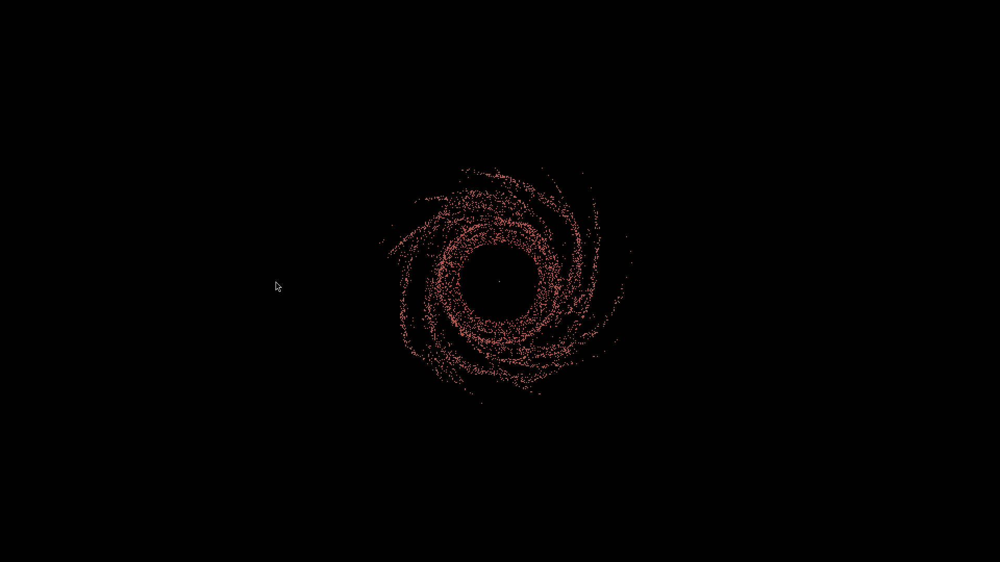
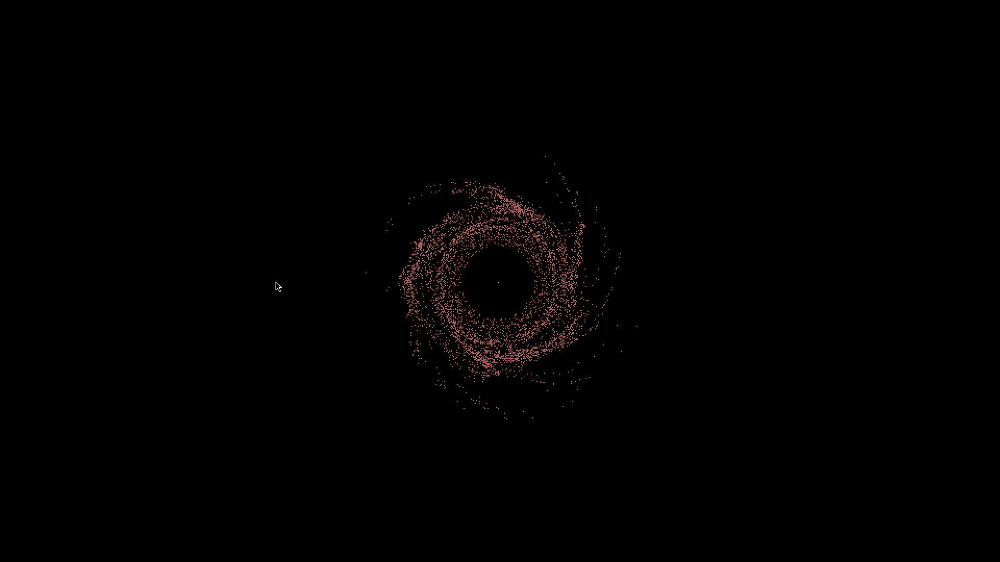
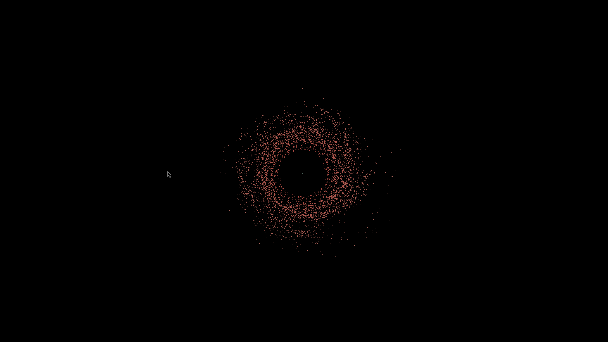
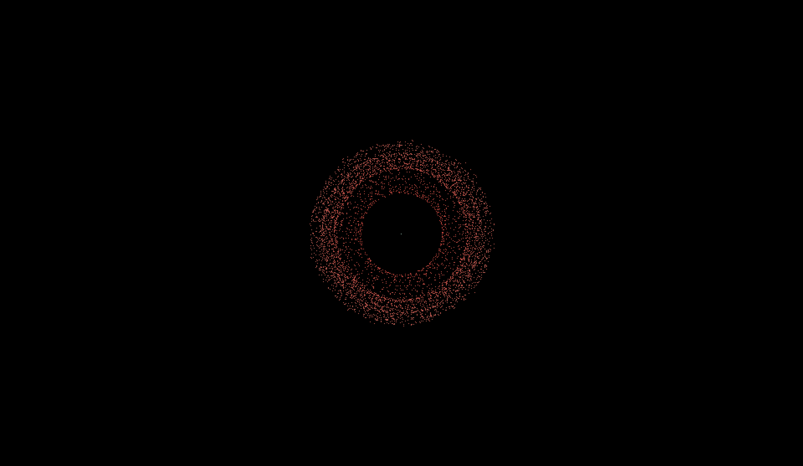

# nbody

N-body simulator implementing Barnes Hut optimisation, softening length and quadtree with eyecandy






# Building

```
cargo build --release
```

# Running


```
cargo run --release
```

